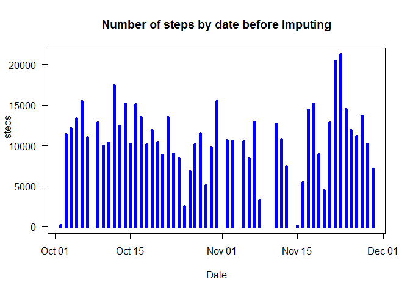
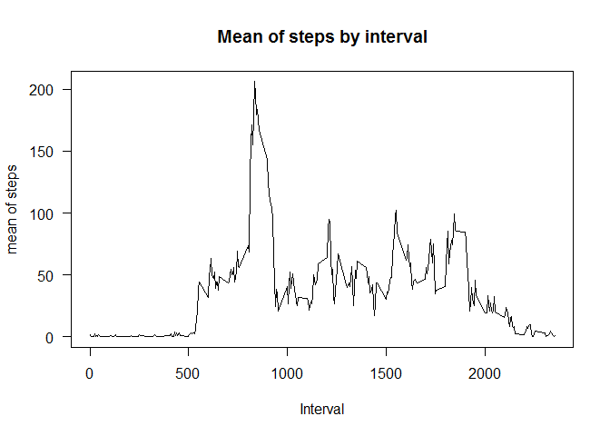
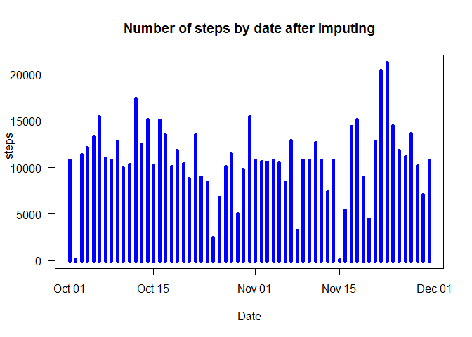

# Reproducible Research: Peer Assessment 1

## Loading and preprocessing the data


```r
activity <- read.csv("activity.csv", head = TRUE, na.strings = "NA",
                     colClass=c('integer', 'Date', 'integer'))
```
 
## What is mean total number of steps taken per day?

Generic X-Y plotting where X-axis = Date, Y-axis = Steps, **type = 'h' (histogram)**.

```r
steps_by_date <- aggregate(steps ~ date, activity, sum)
with (steps_by_date, plot(date, steps, type = 'h', col = "blue", lwd = 5,
                          las = 1, xlab = "Date", ylab = "           steps", 
                          main = "Number of steps by date before Imputing"))
```

 

Mean of the total number of steps taken per day.

```r
with (steps_by_date, mean(steps, na.rm=TRUE)) 
```

```
## [1] 10766.19
```

Median of the total number of steps taken per day.

```r
with (steps_by_date, median(steps, na.rm=TRUE))
```

```
## [1] 10765
```

## What is the average daily activity pattern?

Time series plot of the 5-minute interval (x-axis) and the average number of steps (y-axis).

```r
steps_by_interval <- aggregate(steps ~ interval, activity, mean)
with (steps_by_interval, plot(interval, steps, type='l', las =1, xlab = "Interval",
	ylab = "mean of steps", main ="Mean of steps by interval"))
```

 

Which 5-minute interval contains the maximum number of steps?

```r
with (steps_by_interval, interval[which.max(steps)])
```

```
## [1] 835
```

## Imputing missing values

The total number of missing values in the data set.

```r
sum(is.na(activity$steps))
```

```
## [1] 2304
```

### Filling missing values with the mean for that 5-minute inverval.
1. Extract rows containig "NA"" into a data frame
2. Filling the missig value by merging it with the data frame containing the mean
3. Correct the temporary column name created during merge
4. rbind the data frame to the original data frame after subsetting off "NA" rows
5. Make a histogram of the total number of steps taken each day


```r
na_steps<-subset(activity, is.na(steps))
merged <- merge(na_steps, steps_by_interval, by="interval")
colnames(merged)[colnames(merged)=="steps.y"] <- "steps"
corrected <- subset(merged, TRUE, select=c(steps, date, interval))
updated_activity<-rbind(subset(activity, !is.na(steps)), corrected)
steps_by_date <- aggregate(steps ~ date, updated_activity, sum)

with (steps_by_date, plot(date, steps, type = 'h', col = "blue", lwd = 5,las = 1,
                          xlab = "Date", ylab = "           steps", 
                          main = "Number of steps by date after Imputing"))
```

 

Mean of the total number of steps taken per day.

```r
with (steps_by_date, mean(steps))
```

```
## [1] 10766.19
```

Median of the total number of steps taken per day.

```r
with (steps_by_date, median(steps))
```

```
## [1] 10766.19
```

There are not much difference with Mean and Median between original and imputation. **However, the histogram is more presentable because the missing days were filled in with the average.**


## Are there differences in activity patterns between weekdays and weekends?


Add a factor column of weekdays or weekend to the updated avtivity

```r
dayType <- function(dates) {
  wd <- function(date) {
    if (weekdays(date) %in% c("Saturday", "Sunday")) {"weekend"}
    else {"weekday"} }
  sapply(dates, wd)   }

updated_activity$dayType <- as.factor(dayType(updated_activity$date))
```

Draw a panel plot of a time series

```r
library(lattice)
steps.interval <- aggregate(steps ~ interval + dayType, updated_activity, mean)
xyplot(steps ~ interval | dayType, data=steps.interval, layout=c(1,2), type='l')
```

 

### There are differences in activity patterns between weekdays and weekends in that **weekend activity spreads over the waking hours while weekday activity peaks at certain time period.**
